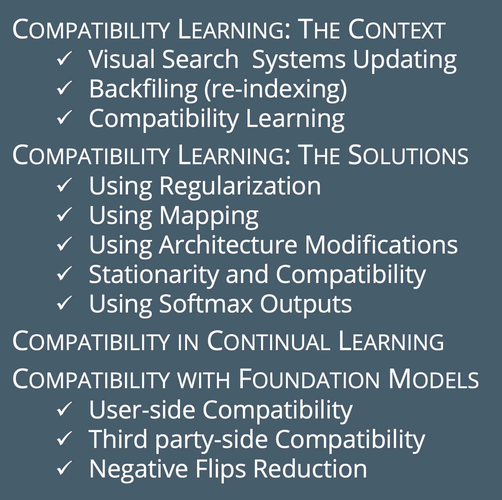

# 🎓 Tutorial on Learning Backward-Compatible Representations
Welcome to our tutorial presented at the **ACM MultiMedia conference 2024**, happening in Melbourne, Australia from October 28th to November 1st 2024.

📅 **Slides Availability**: Our detailed slides will be available starting October 28th. Stay tuned!

## 📚 Tutorial Outline
For a visual summary of what this tutorial covers, check out our outline:

## 📓 Jupyter Notebooks
Explore the Jupyter Notebooks we used during the tutorial in our [Notebooks Folder](./notebooks). These interactive notebooks are perfect for hands-on learning and are also available on Google Colab:

- [d-Simplex with K pre-allocated classes](./notebooks/d_simplex_fixed_classifier.ipynb)
- [Effects of HOC loss during model fine-tuning](./notebooks/Effects_of_HOC_loss.ipynb)
- [Large Model Replacements](./notebooks/large_model_replacement_(iamcl2r).ipynb)

## 🌐 Hosted on Google Colab
Access our notebooks directly on Google Colab from the following links to dive right into the code:
- [d-Simplex with K pre-allocated classes](https://colab.research.google.com/drive/1XBcGlwtxIOcmCzNdHWHBrtM6ziwbZrAN?usp=sharing)
- [Effects of HOC loss during model fine-tuning](https://colab.research.google.com/drive/1aXWhrkg9BVvdLns_iSzCcu1Mk-jBhTEu?usp=sharing)
- [Large Model Replacements](https://colab.research.google.com/drive/1I4WuFdaxEnhPP9tMJUSVz0cIjni6bAt1?usp=sharing)

## 💡 Inspiration
This repository is inspired by groundbreaking work in the field of backward-compatible representations. 
Check out these resources for more insights:
- [cores-compatibility](https://github.com/NiccoBiondi/cores-compatibility)
- [CompatibleLifelongRepresentation](https://github.com/NiccoBiondi/CompatibleLifelongRepresentation)
- [iamcl2r](https://github.com/miccunifi/iamcl2r)

---

🤝 **Join us** at ACM MultiMedia 2024 to learn how we can achieving compatibility in evolving machine learning models without sacrificing performance!

